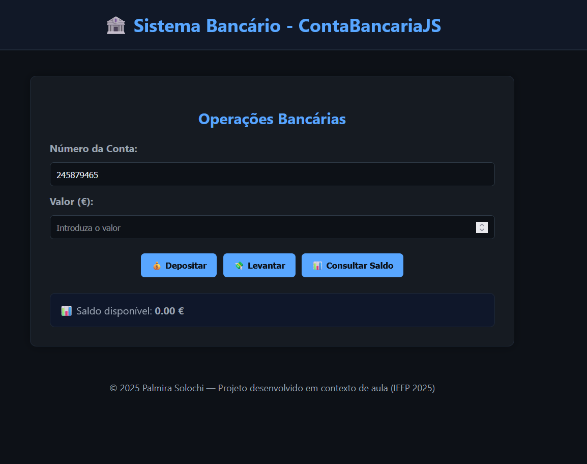
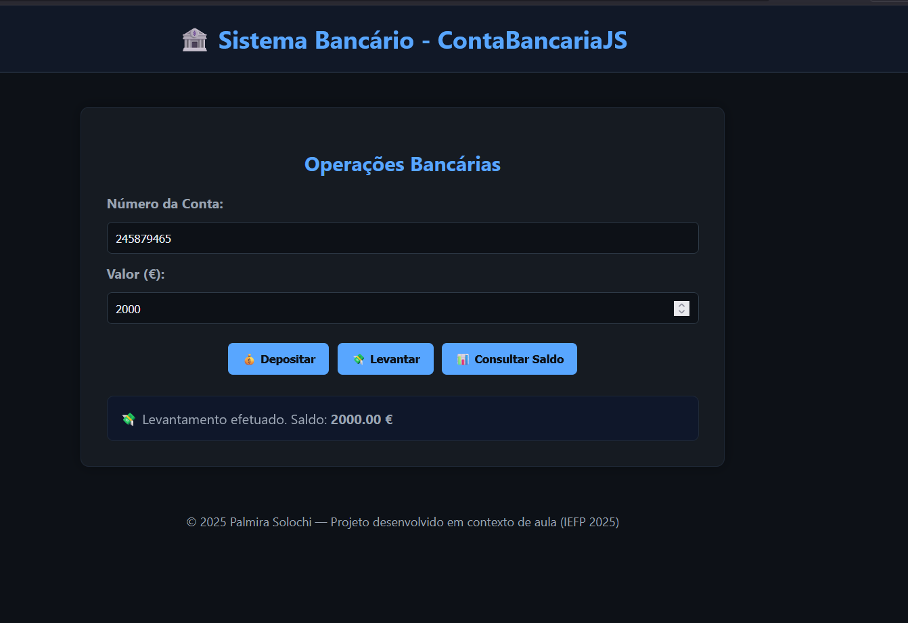

# 💳 Conta Bancária JS

Aplicação desenvolvida por **Palmira Solochi** em contexto de formação (IEFP 2025).  
O projeto simula as principais **operações bancárias** — depósitos, levantamentos e consultas de saldo — com backend em **Node.js + Express** e uma **demonstração interativa online** via GitHub Pages.

---
```
## 🧭 Estrutura do Projeto

ContaBancariaJS/
├── backend/ # Servidor Node.js (API REST)
│ └── server.js
├── frontend/ # Interface local (HTML + JS)
│ ├── index.html
│ ├── app.js
│ └── styles.css
├── docs/ # Demonstração online (GitHub Pages)
│ ├── index.html
│ ├── demo.js
│ └── imagens/
│ ├── tela-principal.png
│ ├── operacoes.png
│ └── banner-contabancaria.png
└── README.md
```


## 🚀 Funcionalidades

- 💰 Depósito em conta  
- 💸 Levantamento com validação de saldo  
- 📊 Consulta de saldo  
- 🧾 Histórico de operações  
- 🔒 Backend em Node.js com API REST  
- 🌐 Demonstração interativa no navegador (GitHub Pages)

---

## ⚙️ Execução Local (com Backend)

### 🔧 Pré-requisitos

- Node.js (v18+)
- npm (v9+)

### 📥 Instalação

```bash
# Clonar o repositório
git clone https://github.com/Pssolochi82/ContaBancariaJS.git
cd ContaBancariaJS

# Instalar dependências
npm install

▶️ Executar o servidor
npm run start


## 🧪 Demonstração Online

Para testar o funcionamento direto no navegador (sem backend):

## 👉 Aceder à Demonstração Interativa

Nesta versão, as operações são simuladas com localStorage, para permitir testes diretamente no browser.

---

## 🎨 Interface e Demonstração

<p align="center">
  <strong>💻 Tela Principal</strong><br>
  
</p>

<p align="center">
  <strong>💰 Depósito | 💸 Levantamento | 📊 Consulta de Saldo | 🧾 Histórico</strong><br>
  
  
  
  
</p>

<p align="center">
  <a href="https://pssolochi82.github.io/ContaBancariaJS/" target="_blank">
    🌐 <strong>Ver Demonstração Interativa no GitHub Pages</strong>
  </a>
</p>

> Prints reais da aplicação **ContaBancariaJS**, com simulação 100% no navegador via LocalStorage.


## 🧰 Tecnologias Utilizadas

Área	Tecnologias
Backend	Node.js, Express.js, CORS
Frontend	HTML5, CSS3, JavaScript (Fetch API)
Demonstração	GitHub Pages, LocalStorage
Controlo de Versão	Git, GitHub

## 🗂️ Endpoints da API (Backend Local)
´´´
Método	Endpoint	Descrição
POST	/depositar	Efetua um depósito
POST	/levantar	Efetua um levantamento
GET	/saldo/:conta	Consulta o saldo atual
´´´

🧑‍💻 Autora

Palmira Solochi
📍 Portugal
💼 QA Profissional | Programadora em Formação
🔗 GitHub
 | Portfolio

“Tecnologia com responsabilidade e propósito.”

📜 Licença

Projeto desenvolvido para fins educativos, em contexto formativo IEFP 2025.
Distribuído sob a licença ISC.